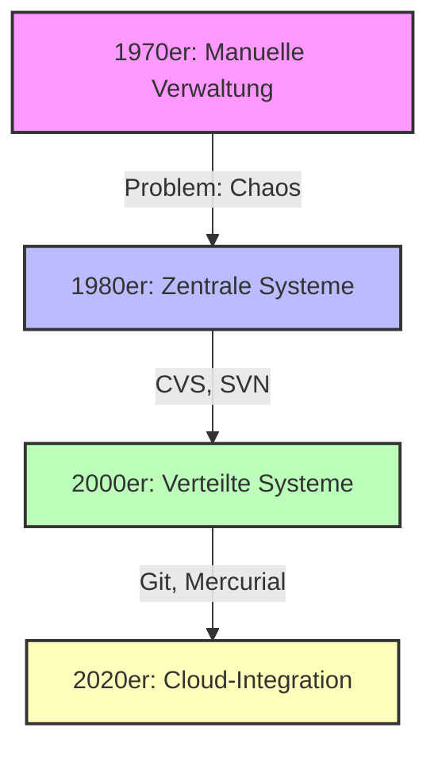
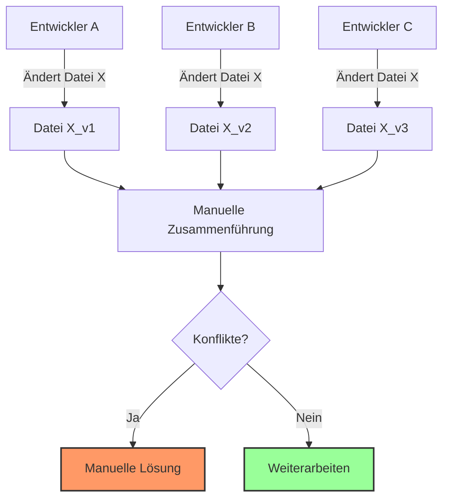
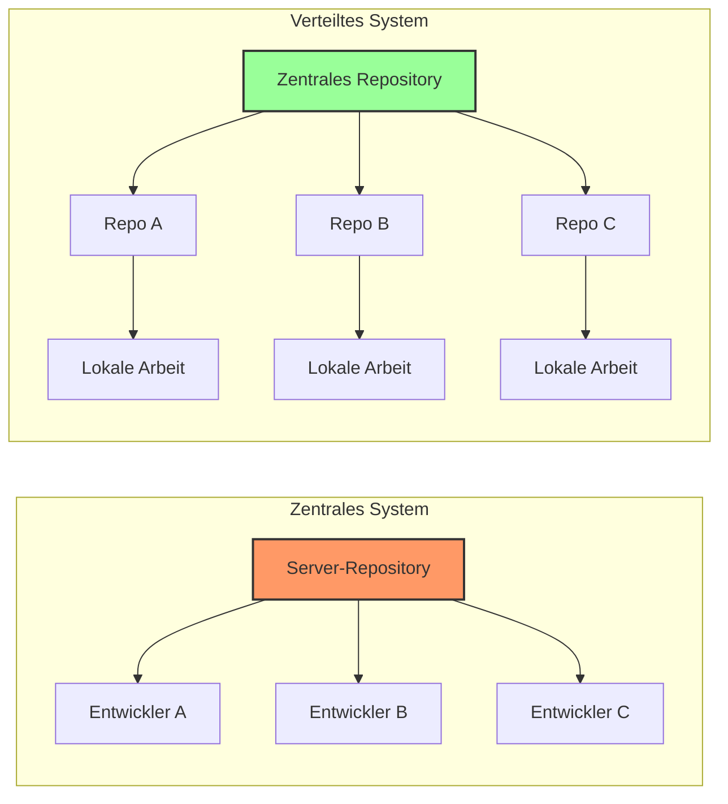
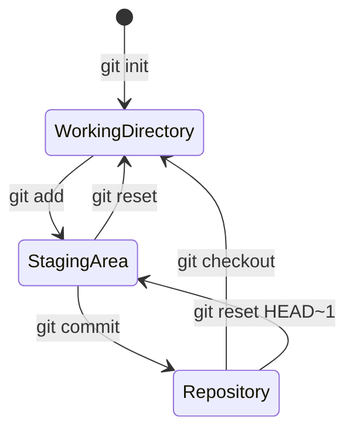
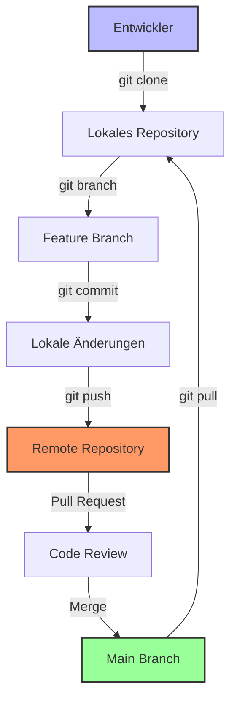

# 1 Einführung in die Versionsverwaltung mit Git

## Willkommen zum Kurs

Dieses Kapitel führt Sie in die Welt der Versionsverwaltung mit Git ein. Sie lernen, warum Versionskontrolle in der modernen Softwareentwicklung unverzichtbar ist und wie Git als das führende Werkzeug diese Herausforderungen löst.

### Lernziele dieses Kapitels

Nach Abschluss dieses Kapitels können Sie:

1. **Verstehen**, was Versionskontrolle ist und warum sie wichtig ist
2. **Erklären**, wie Git im Vergleich zu anderen Systemen funktioniert
3. **Erkennen**, die Vorteile von Git für Ihre Projekte
4. **Vorbereitet** sein für die praktischen Übungen in den folgenden Kapiteln

### Struktur dieses Kapitels

Dieses Kapitel ist in folgende Abschnitte unterteilt:

1. **Was ist Versionskontrolle?** - Grundlagen und Konzepte
2. **Warum brauchen wir Versionskontrolle?** - Probleme ohne Versionskontrolle
3. **Die Evolution der Versionskontrolle** - Von zentral zu verteilt
4. **Einführung in Git** - Was macht Git besonders?
5. **Vorteile von Git** - Warum Git die richtige Wahl ist

---

## Was ist Versionskontrolle?

Versionskontrolle ist ein System, das Änderungen an Dateien oder Dateisystemen im Zeitverlauf aufzeichnet. Es ermöglicht Ihnen:

- **Änderungshistorie** zu verfolgen: Wer hat was wann geändert?
- **Zurückzugehen** zu früheren Versionen: Fehler rückgängig machen
- **Parallel zu arbeiten**: Mehrere Entwickler können gleichzeitig arbeiten
- **Zusammenzuarbeiten**: Änderungen verschiedener Entwickler zusammenführen

### Analogie: Dokumentenverwaltung

Stellen Sie sich vor, Sie arbeiten an einem wichtigen Dokument:

**Ohne Versionskontrolle:**
```
Dokument_v1.doc
Dokument_v2.doc
Dokument_final.doc
Dokument_final_final.doc
Dokument_final_final_v2.doc
```

**Mit Versionskontrolle:**
```
Dokument (mit vollständiger Historie)
├── Version 1: Erste Idee
├── Version 2: Erweiterung um Kapitel 2
├── Version 3: Korrekturen
└── Aktuelle Version: Fertiges Dokument
```

### Mermaid Diagramm: Evolution der Versionskontrolle



---

## Warum brauchen wir Versionskontrolle?

### Die Probleme ohne Versionskontrolle

#### 1. **Verlust von Änderungen**
- Wer hat welche Änderung wann gemacht?
- Wie rollbackt man einen Fehler?
- Welche Version ist die aktuelle?

#### 2. **Kollisionsprobleme**
- Mehrere Entwickler arbeiten gleichzeitig
- Manuelle Zusammenführung ist fehleranfällig
- Konflikte sind schwer zu lösen

#### 3. **Keine Dokumentation**
- Keine automatische Änderungshistorie
- Keine Information über den "Warum"-Aspekt
- Schwierige Wissensweitergabe

#### 4. **Keine Sicherheit**
- Keine Backup-Möglichkeit
- Keine Wiederherstellung bei Katastrophen
- Keine Versionierung von Konfigurationen

### Beispiel: Softwareentwicklung ohne Versionskontrolle



---

## Die Evolution der Versionskontrolle

### Phase 1: Manuelle Verwaltung (1970er)

**Methode:** Dateien mit Versionsnummern benennen
```
Projekt_v1/
├── code_v1.c
├── code_v2.c
├── code_final.c
└── code_final_final.c
```

**Probleme:**
- Keine automatische Historie
- Schwierige Zusammenführung
- Keine Änderungsdokumentation

### Phase 2: Zentrale Systeme (1980er-2000er)

**Beispiele:** CVS, SVN (Subversion)

**Architektur:**
```
Zentrales Server-Repository
        ↑
    Alle Entwickler arbeiten dagegen
```

**Vorteile:**
- Zentrale Historie
- Automatische Versionsverwaltung
- Bessere Zusammenarbeit

**Nachteile:**
- Single Point of Failure (Server-Ausfall)
- Langsame Operationen über Netzwerk
- Keine lokale Arbeit ohne Verbindung

### Phase 3: Verteilte Systeme (2000er-Heute)

**Beispiele:** Git, Mercurial

**Architektur:**
```
Zentrales Repository (GitHub/GitLab)
        ↑
    Jeder Entwickler hat eigenes vollständiges Repository
```

**Vorteile:**
- Kein Single Point of Failure
- Schnelle lokale Operationen
- Arbeit auch ohne Netzwerkverbindung
- Flexible Arbeitsmodelle

### Mermaid Diagramm: Zentral vs. Verteilt



---

## Einführung in Git

### Was ist Git?

Git ist ein **verteiltes Versionskontrolssystem** (DVCS), das 2005 von Linus Torvalds für die Linux-Kernel-Entwicklung erstellt wurde.

**Kernmerkmale:**
- **Schnell**: Lokale Operationen sind extrem schnell
- **Dezentral**: Jeder Entwickler hat ein vollständiges Repository
- **Flexible Arbeitsmodelle**: Support für verschiedene Workflows
- **Robust**: Starke Datenintegrität durch kryptografische Hashing
- **Open Source**: Kostenlos und frei verfügbar

### Die drei Zustände in Git

Jede Datei in Git kann sich in einem von drei Zuständen befinden:



1. **Working Directory**: Ihre lokalen Dateien
2. **Staging Area**: Vorbereitete Änderungen
3. **Repository**: Gespeicherte Versionen

### Git vs. Andere Systeme

| Feature | Git | SVN | CVS |
|---------|-----|-----|-----|
| Verteilt | ✅ | ❌ | ❌ |
| Geschwindigkeit | ⭐⭐⭐⭐⭐ | ⭐⭐⭐ | ⭐⭐ |
| Branching | ⭐⭐⭐⭐⭐ | ⭐⭐ | ⭐ |
| Offline-Arbeit | ✅ | ❌ | ❌ |
| Community | ⭐⭐⭐⭐⭐ | ⭐⭐⭐ | ⭐⭐ |

---

## Vorteile von Git

### 1. **Schnelligkeit**
- Lokale Operationen sind sofort verfügbar
- Keine Wartezeiten für Netzwerkoperationen
- Effiziente Datenstrukturen

### 2. **Flexibilität**
- Verschiedene Arbeitsmodelle (GitFlow, GitHub Flow, Trunk-Based)
- Support für große Projekte
- Anpassbar an verschiedene Workflows

### 3. **Sicherheit**
- Kryptografische Integrität
- Keine Datenverluste durch lokale Kopien
- Vollständige Historie

### 4. **Kollaboration**
- Einfache Zusammenarbeit über Remote-Repositories
- Pull Requests für Code-Reviews
- Integration mit CI/CD-Pipelines

### 5. **Ökosystem**
- GitHub, GitLab, Bitbucket
- Unzählige Tools und Integrationen
- Große Community und Support

### Mermaid Diagramm: Git-Workflow



---

## Zusammenfassung

### Was haben wir gelernt?

1. **Versionskontrolle** ist essentiell für moderne Softwareentwicklung
2. **Git** ist das führende verteilte Versionskontrolssystem
3. **Drei Zustände**: Working Directory, Staging Area, Repository
4. **Vorteile**: Schnelligkeit, Flexibilität, Sicherheit, Kollaboration

### Warum Git?

- **Industriestandard**: Wird von den meisten Unternehmen verwendet
- **Open Source**: Kostenlos und frei verfügbar
- **Große Community**: Umfangreiche Unterstützung und Ressourcen
- **Zukunftssicher**: Weiterentwicklung und Integration mit modernen Tools

### Nächste Schritte

In den folgenden Kapiteln werden wir:
1. Die historische Entwicklung von Versionskontrolle vertiefen
2. Die grundlegenden Konzepte von Git verstehen
3. Git installieren und erste Schritte machen
4. Praktische Übungen durchführen

---

## Praktische Übung

{{ task(file="tasks/01_00_01.yaml") }}

---

## Ressourcen

- **Offizielle Git-Dokumentation**: https://git-scm.com/doc
- **Pro Git Buch**: https://git-scm.com/book/de/v2
- **GitHub Learning Lab**: https://lab.github.com/

---

## Nächster Schritt

Nachdem Sie die Grundlagen der Versionskontrolle verstanden haben, werden wir im nächsten Kapitel die **Kursübersicht** betrachten und den 2-tägigen Lernplan kennenlernen.

[Weiter zu Kapitel 2: Kursübersicht](2.md)