# 5.2 Projektadministration und Best Practices

## Einführung

In diesem Kapitel lernen Sie, wie Sie Git-Repositories professionell verwalten und Best Practices für die Projektadministration umsetzen.

## Repository-Struktur

```mermaid
graph TD
    A[mein-projekt] --> B[.git]
    A --> C[.gitignore]
    A --> D[README.md]
    A --> E[LICENSE]
    A --> F[CONTRIBUTING.md]
    A --> G[CODE_OF_CONDUCT.md]
    A --> H[.github]
    A --> I[docs]
    A --> J[src]
    A --> K[tests]
    A --> L[scripts]
    A --> M[docker]
    A --> N[.env.example]
    A --> O[requirements.txt]

    H --> H1[workflows]
    H --> H2[ISSUE_TEMPLATE]
    H1 --> H11[ci.yml]
    H1 --> H12[cd.yml]
    H2 --> H21[bug_report.md]
    H2 --> H22[feature_request.md]

    I --> I1[index.md]
    I --> I2[api.md]
    I --> I3[getting-started.md]

    J --> J1[main.py]
    J --> J2[utils.py]

    K --> K1[test_main.py]
    K --> K2[test_utils.py]

    L --> L1[setup.sh]
    L --> L2[deploy.sh]

    M --> M1[Dockerfile]
    M --> M2[docker-compose.yml]

    style A fill:#f9f,stroke:#333,stroke-width:2px
    style B fill:#bbf,stroke:#333,stroke-width:2px
    style C fill:#bfb,stroke:#333,stroke-width:2px
    style D fill:#fbb,stroke:#333,stroke-width:2px
    style E fill:#bbf,stroke:#333,stroke-width:2px
    style F fill:#bfb,stroke:#333,stroke-width:2px
    style G fill:#fbb,stroke:#333,stroke-width:2px
    style H fill:#bbf,stroke:#333,stroke-width:2px
    style I fill:#bfb,stroke:#333,stroke-width:2px
    style J fill:#fbb,stroke:#333,stroke-width:2px
    style K fill:#bbf,stroke:#333,stroke-width:2px
    style L fill:#bfb,stroke:#333,stroke-width:2px
    style M fill:#fbb,stroke:#333,stroke-width:2px
```



### Standard-Struktur für Projekte

```
mein-projekt/
├── .git/
├── .gitignore
├── .gitattributes
├── README.md
├── LICENSE
├── CHANGELOG.md
├── CONTRIBUTING.md
├── CODE_OF_CONDUCT.md
├── .github/
│   ├── workflows/
│   │   ├── ci.yml
│   │   └── cd.yml
│   └── ISSUE_TEMPLATE/
│       ├── bug_report.md
│       └── feature_request.md
├── docs/
│   ├── index.md
│   ├── api.md
│   └── getting-started.md
├── src/
│   ├── main.py
│   └── utils.py
├── tests/
│   ├── test_main.py
│   └── test_utils.py
├── scripts/
│   ├── setup.sh
│   └── deploy.sh
├── docker/
│   ├── Dockerfile
│   └── docker-compose.yml
├── .env.example
├── requirements.txt
├── package.json
└── .editorconfig
```

### Wichtige Dateien im Detail

**1. README.md**:
```markdown
# Projektname

Kurze Beschreibung des Projekts

## Installation

```bash
git clone https://github.com/user/repo.git
cd repo
pip install -r requirements.txt
```

## Verwendung

```bash
python main.py
```

## Contributing

Siehe [CONTRIBUTING.md](CONTRIBUTING.md)

## License

MIT
```

**2. CONTRIBUTING.md**:
```markdown
# Contributing Guidelines

## Wie beizutragen

1. Fork das Repository
2. Erstelle einen Feature-Branch
3. Commit Ihre Änderungen
4. Push zum Branch
5. Erstellen Sie einen Pull Request

## Code Style

- Verwende PEP 8 für Python
- Verwende 2 Leerzeichen für Einrückungen
- Schreibe Tests für neue Features

## Pull Request Template

- [ ] Code funktioniert
- [ ] Tests sind geschrieben
- [ ] Dokumentation ist aktualisiert
```

**3. CODE_OF_CONDUCT.md**:
```markdown
# Code of Conduct

## Unsere Standards

- Respektvolle Kommunikation
- Inklusive Umgebung
- Konstruktives Feedback

## Enforcement

Verstöße werden gemeldet und behandelt.
```

## Branching-Strategien

### 1. GitFlow

**Struktur**:
```
main (master)
├── develop
│   ├── feature/login
│   ├── feature/payment
│   └── feature/api
├── release/v1.0.0
└── hotfix/security-issue
```

**Regeln**:
- `main`: Produktionscode, immer deployable
- `develop`: Entwicklungscode, Integration aller Features
- `feature/*`: Neue Features
- `release/*`: Release-Vorbereitung
- `hotfix/*`: Kritische Bugfixes

**Workflow**:
```bash
# Feature starten
git checkout develop
git checkout -b feature/new-feature

# Feature abschließen
git checkout develop
git merge feature/new-feature
git branch -d feature/new-feature

# Release erstellen
git checkout -b release/v1.0.0 develop
# ... Vorbereitung ...
git checkout main
git merge release/v1.0.0
git tag v1.0.0
git checkout develop
git merge release/v1.0.0
git branch -d release/v1.0.0
```

### 2. GitHub Flow

**Struktur**:
```
main
├── feature/branch-1
├── feature/branch-2
└── feature/branch-3
```

**Regeln**:
- `main` ist immer deployable
- Jede Änderung in separatem Branch
- Pull Request für jede Änderung
- Merge nach Code Review

**Workflow**:
```bash
# 1. Von main starten
git checkout main
git pull origin main

# 2. Neuen Branch erstellen
git checkout -b feature/new-feature

# 3. Änderungen machen
# ... Code ...

# 4. Commit und push
git commit -m "Add new feature"
git push -u origin feature/new-feature

# 5. Pull Request erstellen
# 6. Nach Review: Merge in main
```

### 3. Trunk-Based Development

**Struktur**:
```
main (trunk)
├── short-lived-feature-1
├── short-lived-feature-2
└── short-lived-feature-3
```

**Regeln**:
- Kurzlebige Branches (maximal 1-2 Tage)
- Häufiges Merge in main
- Feature Flags für in-flight Features
- Automatisierte Tests

## Commit-Nachrichten

### Konventionelle Commits

**Format**:
```
<type>(<scope>): <description>

[optional body]

[optional footer]
```

**Types**:
- `feat`: Neues Feature
- `fix`: Bugfix
- `docs`: Dokumentation
- `style`: Code-Style (keine Funktionsänderung)
- `refactor`: Code-Refactoring
- `test`: Tests
- `chore`: Build-Prozess, Tools

**Beispiele**:

```bash
# Feature
git commit -m "feat(auth): Add user authentication"

# Bugfix
git commit -m "fix(api): Fix null pointer exception"

# Dokumentation
git commit -m "docs(readme): Update installation instructions"

# Refactoring
git commit -m "refactor(utils): Simplify validation logic"
```

### Gute Commit-Nachrichten

**Schlecht**:
```
fix stuff
update
```

**Gut**:
```
fix(login): Handle invalid credentials gracefully

- Add proper error messages for wrong passwords
- Implement rate limiting for failed attempts
- Log security events for audit trail

Closes #123
```

## Code Review

### Checkliste für Code Review

**Funktionalität**:
- [ ] Code funktioniert wie erwartet
- [ ] Alle Anforderungen sind erfüllt
- [ ] Edge Cases sind berücksichtigt

**Code Quality**:
- [ ] Code ist lesbar und verständlich
- [ ] Keine Code-Duplizierung
- [ ] Einhaltung der Code-Conventions
- [ ] Sinnvolle Variablennamen

**Tests**:
- [ ] Unit Tests sind geschrieben
- [ ] Integration Tests sind geschrieben
- [ ] Tests sind ausreichend
- [ ] Tests sind lesbar

**Dokumentation**:
- [ ] Code ist dokumentiert
- [ ] README ist aktualisiert
- [ ] API-Dokumentation ist aktuell

**Sicherheit**:
- [ ] Keine Sicherheitslücken
- [ ] Sensible Daten sind geschützt
- [ ] Input-Validierung ist vorhanden

### Pull Request Template

**GitHub** (`.github/pull_request_template.md`):
```markdown
## Description

Describe your changes here

## Type of Change

- [ ] Bug fix (non-breaking change)
- [ ] New feature (non-breaking change)
- [ ] Breaking change
- [ ] Documentation update

## Checklist

- [ ] Code follows project style guidelines
- [ ] Tests pass
- [ ] Documentation updated
- [ ] No new dependencies added

## Screenshots

[Add screenshots if applicable]

## Related Issues

Fixes #123
```

## CI/CD Pipelines

### GitHub Actions

**1. Test-Pipeline** (`.github/workflows/test.yml`):
```yaml
name: Test

on:
  push:
    branches: [ main, develop ]
  pull_request:
    branches: [ main ]

jobs:
  test:
    runs-on: ubuntu-latest

    steps:
    - uses: actions/checkout@v4

    - name: Setup Python
      uses: actions/setup-python@v5
      with:
        python-version: '3.11'

    - name: Install dependencies
      run: |
        python -m pip install --upgrade pip
        pip install -r requirements.txt

    - name: Run tests
      run: |
        python -m pytest

    - name: Run linting
      run: |
        python -m flake8 src/
```

**2. Deploy-Pipeline** (`.github/workflows/deploy.yml`):
```yaml
name: Deploy

on:
  push:
    branches: [ main ]

jobs:
  deploy:
    runs-on: ubuntu-latest

    steps:
    - uses: actions/checkout@v4

    - name: Setup Python
      uses: actions/setup-python@v5
      with:
        python-version: '3.11'

    - name: Install dependencies
      run: |
        pip install -r requirements.txt

    - name: Build
      run: |
        python setup.py build

    - name: Deploy to server
      run: |
        # Deploy commands
```

### GitLab CI/CD

**.gitlab-ci.yml**:
```yaml
stages:
  - test
  - build
  - deploy

test:
  stage: test
  image: python:3.11
  script:
    - pip install -r requirements.txt
    - python -m pytest
  only:
    - main
    - develop

build:
  stage: build
  image: python:3.11
  script:
    - pip install -r requirements.txt
    - python setup.py build
  artifacts:
    paths:
      - dist/

deploy:
  stage: deploy
  image: alpine:latest
  script:
    - apk add --no-cache rsync openssh
    - rsync -avz dist/ user@server:/path/to/deploy
  only:
    - main
```

## Repository-Wartung

### 1. Repository aufräumen

**Unnötige Dateien entfernen**:
```bash
# Datei aus Historie entfernen (Vorsicht!)
git filter-branch --force --index-filter \
  'git rm --cached --ignore-unmatch sensibel.txt' \
  --prune-empty --tag-name-filter cat -- --all
```

**Große Dateien finden**:
```bash
# Große Dateien im Repository finden
git rev-list --objects --all | \
  git cat-file --batch-check='%(objecttype) %(objectname) %(objectsize) %(rest)' | \
  sed -n 's/^blob //p' | \
  sort --numeric-sort --key=2 | \
  cut -c 1-12,41- | \
  numfmt --field=2 --to=iec-i --suffix=B --padding=7 --round=nearest
```

### 2. Branches aufräumen

**Alte Branches löschen**:
```bash
# Lokale Branches, die im Remote nicht mehr existieren
git fetch -p

# Alte Branches löschen (älter als 30 Tage)
git branch --merged main | grep -v "main\|develop" | xargs git branch -d
```

### 3. Tags verwalten

**Tags erstellen**:
```bash
# Leichtes Tag
git tag v1.0.0

# Annotiertes Tag
git tag -a v1.0.0 -m "Release version 1.0.0"

# Tag pushen
git push origin v1.0.0
git push origin --tags
```

**Tags löschen**:
```bash
# Lokal löschen
git tag -d v1.0.0

# Remote löschen
git push origin --delete v1.0.0
```

## Sicherheit

### 1. Zugriffskontrolle

**GitHub**:
- Repository-Visibility: Public/Private
- Branch-Protection: Erfordert Pull Requests
- Zugriffskontrolle: Wer kann pushen/mergen?

**GitLab**:
- Projekt-Visibility
- Protected Branches
- Member-Rollen (Maintainer, Developer, etc.)

### 2. Secrets Management

**Falsch**:
```python
# config.py
API_KEY = "abc123xyz"  # ❌ SICHERHEITSRISIKO!
```

**Richtig**:
```python
# config.py
import os

API_KEY = os.getenv('API_KEY')
```

**GitHub Secrets**:
1. Settings → Secrets and variables → Actions
2. New repository secret
3. Name: `API_KEY`
4. Value: `abc123xyz`

**Verwendung in Workflow**:
```yaml
- name: Use API Key
  env:
    API_KEY: ${{ '{{' }} secrets.API_KEY {{ '}}' }}
  run: |
    echo "Using API key"
```

### 3. Dependabot

**GitHub Dependabot**:
```yaml
# .github/dependabot.yml
version: 2
updates:
  - package-ecosystem: "pip"
    directory: "/"
    schedule:
      interval: "weekly"
    open-pull-requests-limit: 10
```

## Monitoring und Metriken

### 1. Repository-Statistiken

**GitHub Insights**:
- Code frequency
- Pull request statistics
- Contributor statistics

**GitLab Analytics**:
- Project analytics
- CI/CD statistics
- Merge request analytics

### 2. Code Coverage

**Python mit pytest-cov**:
```bash
# Installation
pip install pytest-cov

# Ausführung
pytest --cov=src/ --cov-report=html

# In CI/CD
- name: Run tests with coverage
  run: |
    pip install pytest-cov
    pytest --cov=src/ --cov-report=xml
```

**GitHub Actions Integration**:
```yaml
- name: Upload coverage to Codecov
  uses: codecov/codecov-action@v3
  with:
    file: ./coverage.xml
```

## Best Practices Zusammenfassung

### 1. Repository-Management
- Klare Struktur mit Standard-Verzeichnissen
- Wichtige Dateien: README, CONTRIBUTING, LICENSE
- .gitignore für alle unnötigen Dateien

### 2. Branching
- Wähle passende Branching-Strategie
- Kurzlebige Branches bevorzugen
- `main` immer deployable halten

### 3. Commits
- Konventionelle Commits verwenden
- Kleine, logische Commits
- Gute Commit-Nachrichten

### 4. Code Review
- Pull Requests für alle Änderungen
- Checkliste für Reviews
- Konstruktives Feedback

### 5. CI/CD
- Automatisierte Tests
- Automatisches Deployment
- Code Coverage messen

### 6. Sicherheit
- Secrets nie committen
- Zugriffskontrolle implementieren
- Abhängigkeiten aktualisieren

### 7. Wartung
- Repository regelmäßig aufräumen
- Alte Branches löschen
- Tags für Releases verwenden

## Praktische Übung

### Übung 1: Repository-Struktur erstellen

```bash
# 1. Neues Projekt erstellen
mkdir professional-project
cd professional-project
git init

# 2. Standard-Struktur erstellen
mkdir -p src tests docs .github/workflows scripts docker

# 3. Wichtige Dateien erstellen
touch README.md LICENSE CONTRIBUTING.md CODE_OF_CONDUCT.md
touch .gitignore .editorconfig .env.example
touch requirements.txt package.json

# 4. GitHub Actions erstellen
mkdir -p .github/workflows
cat > .github/workflows/ci.yml << 'EOF'
name: CI
on: [push, pull_request]
jobs:
  test:
    runs-on: ubuntu-latest
    steps:
    - uses: actions/checkout@v4
    - name: Setup Python
      uses: actions/setup-python@v5
      with:
        python-version: '3.11'
    - name: Install dependencies
      run: pip install -r requirements.txt
    - name: Run tests
      run: python -m pytest
EOF

# 5. Commit
git add .
git commit -m "Initial project structure"
```

### Übung 2: Branching-Strategie implementieren

```bash
# 1. Hauptbranch erstellen
git checkout -b main
git push -u origin main

# 2. Feature-Branch erstellen
git checkout -b feature/user-auth
# ... Code schreiben ...
git commit -m "feat(auth): Add user authentication"
git push -u origin feature/user-auth

# 3. Pull Request erstellen (auf GitHub)
# 4. Nach Review: Merge in main
git checkout main
git merge feature/user-auth
git push origin main
git branch -d feature/user-auth
```

### Übung 3: CI/CD Pipeline testen

```bash
# 1. Test-Datei erstellen
cat > tests/test_example.py << 'EOF'
def test_example():
    assert 1 + 1 == 2
EOF

# 2. Push auslösen CI/CD
git add .
git commit -m "Add test"
git push origin main

# 3. GitHub Actions überprüfen
# 4. Erfolgreichen Build anzeigen
```

## Zusammenfassung

**Repository-Struktur**:
- Klare, standardisierte Verzeichnisse
- Wichtige Dokumente (README, CONTRIBUTING, etc.)
- CI/CD Integration

**Branching-Strategien**:
- GitFlow für komplexe Projekte
- GitHub Flow für einfache Projekte
- Trunk-Based für schnelle Entwicklung

**Commit-Nachrichten**:
- Konventionelle Commits
- Klare, beschreibende Nachrichten
- Referenzen zu Issues

**Code Review**:
- Pull Requests für alle Änderungen
- Checkliste für Qualität
- Konstruktives Feedback

**CI/CD**:
- Automatisierte Tests
- Automatisches Deployment
- Code Coverage

**Sicherheit**:
- Secrets Management
- Zugriffskontrolle
- Dependabot für Updates

{{ task(file="tasks/10_00_01.yaml") }}