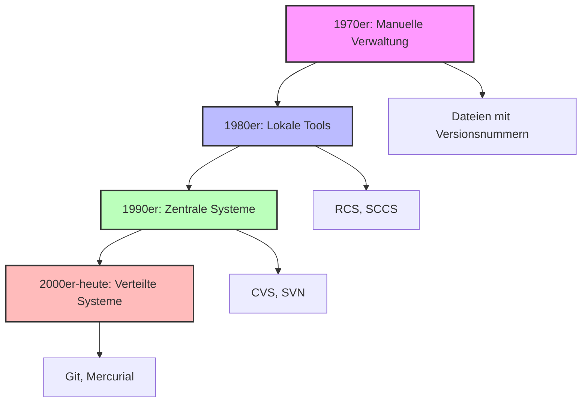

# 3.1 Historische Entwicklung und Bedarf an Versionskontrolle

## Einführung

Bevor wir uns mit Git befassen, müssen wir verstehen, warum Versionskontrolle überhaupt notwendig geworden ist. Dieses Verständnis hilft uns, die Konzepte besser zu begreifen und die richtigen Werkzeuge auszuwählen.

## Die Anfänge der Programmierung

### Die 1950er und 1960er Jahre

In den frühen Tagen der Programmierung arbeiteten Entwickler oft allein oder in sehr kleinen Teams. Die Herausforderungen waren anders als heute:

- **Keine Netzwerke**: Code wurde auf Lochkarten oder Magnetbändern gespeichert
- **Keine Zusammenarbeit**: Jeder Entwickler arbeitete an seinem eigenen Exemplar
- **Keine Versionsverfolgung**: Änderungen wurden manuell dokumentiert oder gar nicht

### Die 1970er Jahre: Erste Probleme

Mit wachsenden Projekten und Teams entstanden erste Probleme:

```
1970: Ein Entwickler arbeitet an "programm_v1.f"
1971: Ein zweiter Entwickler arbeitet an "programm_v2.f"
1972: Keiner weiß, welche Version die aktuelle ist
1973: Die beiden Versionen müssen zusammengeführt werden → Chaos!
```

## Die Evolution der Versionskontrolle



### Phase 1: Manuelle Verwaltung (1970er-1980er)

**Ansatz**: Dateien mit Versionsnummern benennen
```
programm_v1.f
programm_v2.f
programm_v3_final.f
programm_v3_final_final.f
programm_v3_final_final_v2.f
```

**Probleme**:
- Keine automatische Erkennung von Änderungen
- Schwierige Zusammenarbeit
- Keine Möglichkeit, Änderungen rückgängig zu machen
- Hoher manueller Aufwand

### Phase 2: Lokale Versionskontrolle (1980er-1990er)

**Erste Tools**: RCS (Revision Control System), SCCS (Source Code Control System)

**Funktionen**:
- Speichern von Deltas (Unterschieden) zwischen Versionen
- Lokale Verwaltung auf einem einzelnen Rechner
- Einfache Rückgängig-Machen-Funktion

**Einschränkungen**:
- Keine Unterstützung für verteilte Teams
- Keine automatische Synchronisation
- Komplexe Befehle

### Phase 3: Zentrale Versionskontrolle (1990er-2000er)

**Tools**: CVS (Concurrent Versions System), SVN (Subversion)

**Konzept**: Ein zentrales Server-Repository, das alle Entwickler nutzen

```
Zentrales Repository (Server)
        ↑
    alle Entwickler
        ↓
   Lokale Arbeitskopien
```

**Vorteile**:
- Echte Teamarbeit möglich
- Zentrale Wahrheitsquelle
- Bessere Verwaltung großer Projekte

**Nachteile**:
- Single Point of Failure (Server-Ausfall)
- Langsame Operationen über Netzwerk
- Komplexe Verzweigungsstrategien

### Phase 4: Verteilte Versionskontrolle (2000er-heute)

**Tools**: Git, Mercurial, Bazaar

**Konzept**: Jeder Entwickler hat ein vollständiges Repository

```
Entwickler A: [vollständiges Repository] ←→ [vollständiges Repository] ←→ Entwickler B
```

**Vorteile**:
- Kein Single Point of Failure
- Schnelle lokale Operationen
- Flexible Arbeitsweisen
- Offline-Fähigkeit

## Warum ist Versionskontrolle heute unverzichtbar?

### 1. Komplexität moderner Software

Moderne Softwareprojekte bestehen aus:
- Tausenden von Dateien
- Hunderten von Entwicklern
- Mehreren Jahren Entwicklung
- Kontinuierlichen Änderungen

**Beispiel**: Ein typisches Webprojekt
```
Frontend: 500+ Dateien (HTML, CSS, JavaScript)
Backend: 300+ Dateien (Python, Java, C#)
Datenbank: 50+ Migrationen
Tests: 200+ Testdateien
Dokumentation: 100+ Seiten
```

### 2. Teamarbeit und Kollaboration

**Szenario**: 5 Entwickler arbeiten an einem Projekt
- Entwickler A: Arbeitet an der Benutzeroberfläche
- Entwickler B: Arbeitet an der Datenbank
- Entwickler C: Arbeitet an der API
- Entwickler D: Arbeitet an den Tests
- Entwickler E: Arbeitet an der Dokumentation

**Ohne Versionskontrolle**:
- Jeder arbeitet an separaten Kopien
- Zusammenführung ist manuell und fehleranfällig
- Keine Übersicht über Änderungen

**Mit Versionskontrolle**:
- Parallele Arbeit ohne Konflikte
- Automatische Zusammenführung
- Vollständige Änderungshistorie

### 3. Qualitätssicherung

Versionskontrolle ermöglicht:
- **Code Reviews**: Änderungen werden vor dem Merge überprüft
- **Automatisierte Tests**: Jede Änderung wird getestet
- **Rollback**: Bei Fehlern kann man zur vorherigen Version zurückkehren
- **Audit Trail**: Wer hat was wann geändert?

### 4. Compliance und Sicherheit

In vielen Branchen (Finanzwesen, Gesundheit, Luftfahrt) ist Versionskontrolle gesetzlich vorgeschrieben:
- Nachvollziehbarkeit von Änderungen
- Dokumentation für Audits
- Sicherheitsrelevante Änderungen müssen nachvollziehbar sein

## Die heutige Landschaft

### Git als De-facto-Standard

- **Marktanteil**: Über 90% der Softwareprojekte nutzen Git
- **Plattformen**: GitHub, GitLab, Bitbucket, Azure DevOps
- **Integration**: CI/CD, Code Review, Projektmanagement

### Cloud-basierte Entwicklung

- **GitHub Codespaces**: Entwicklung in der Cloud
- **GitPod**: Browser-basierte Entwicklungsumgebungen
- **Remote-Repositories**: Zentrale Kollaboration

## Zusammenfassung

**Historische Entwicklung**:
1. Manuelle Verwaltung (1970er)
2. Lokale Tools (1980er)
3. Zentrale Systeme (1990er)
4. Verteilte Systeme (2000er-heute)

**Warum heute unverzichtbar**:
- Komplexität moderner Projekte
- Teamarbeit über Entfernungen
- Qualitätssicherung
- Compliance-Anforderungen

**Git als Lösung**:
- Verteiltes Modell
- Hohe Performance
- Große Community
- Integration in moderne Tools

{{ task(file="tasks/03_00_01.yaml") }}