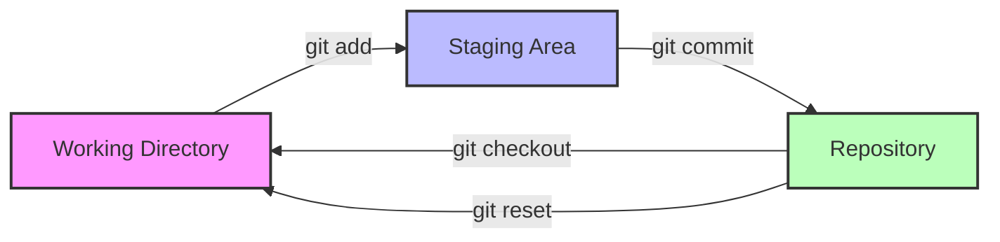

# 3.2 Grundlegende Konzepte und Terminologie

## Einführung

Bevor wir mit Git beginnen, müssen wir die grundlegenden Konzepte verstehen. Diese Begriffe bilden das Fundament für alle weiteren Operationen.

## Die drei Zustände einer Datei in Git



### 1. Working Directory (Arbeitsverzeichnis)

**Was ist das?**
- Der Ordner auf Ihrem Computer, in dem Sie arbeiten
- Enthält alle Dateien Ihres Projekts
- **Zustand**: "Untracked" (nicht versioniert) oder "Modified" (geändert)

**Beispiel**:
```
/mein-projekt/
├── index.html          ← Working Directory
├── style.css           ← Working Directory
├── script.js           ← Working Directory
└── README.md           ← Working Directory
```

### 2. Staging Area (Bereitstellungsarea)

**Was ist das?**
- Ein Zwischenbereich, in dem Sie Änderungen für den nächsten Commit vorbereiten
- **Zustand**: "Staged" (bereitgestellt)

**Warum brauchen wir das?**
- Nicht alle Änderungen sollen sofort committet werden
- Sie können gezielt auswählen, was committet werden soll
- Ermöglicht logische Gruppierung von Änderungen

**Beispiel**:
```
Working Directory:     style.css (geändert)
                       index.html (geändert)
                       script.js (geändert)

Staging Area:          style.css (bereitgestellt)
                       index.html (bereitgestellt)

Nicht bereitgestellt:  script.js
```

### 3. Repository (Lokales Repository)

**Was ist das?**
- Die Datenbank mit der vollständigen Änderungshistorie
- **Zustand**: "Committed" (gespeichert)

**Inhalt**:
- Alle Commits (Versionen)
- Branches
- Tags
- Metadaten

**Beispiel**:
```
Repository:
├── Commit 1: Initial commit
├── Commit 2: Add header styling
├── Commit 3: Fix navigation bug
└── Commit 4: Add responsive design
```

## Die Git-Objekte

### 1. Blobs (Binary Large Objects)

**Was sind sie?**
- Speichern den Inhalt einer Datei
- Werden durch SHA-1 Hash identifiziert
- Inhaltlich identische Dateien werden nur einmal gespeichert

**Beispiel**:
```
Datei: style.css
Inhalt: body { background: white; }
Hash: 8b7a1c... (SHA-1)
```

### 2. Trees (Verzeichnisstrukturen)

**Was sind sie?**
- Speichern die Struktur eines Verzeichnisses
- Enthalten Verweise auf Blobs und andere Trees
- Bilden das Dateisystem des Projekts

**Beispiel**:
```
Tree: /src/
├── Blob: index.html (Hash: abc123)
├── Blob: style.css (Hash: def456)
└── Tree: /images/ (Hash: ghi789)
```

### 3. Commits

**Was sind sie?**
- Schnappschuss des gesamten Projekts zu einem Zeitpunkt
- Enthalten:
  - Verweis auf den vorherigen Commit (Parent)
  - Verweis auf den Root-Tree
  - Metadaten (Autor, Datum, Nachricht)
  - Eindeutige Commit-ID (SHA-1)

**Beispiel**:
```
Commit: abc123
├── Parent: def456 (vorheriger Commit)
├── Tree: ghi789 (Projektstruktur)
├── Autor: Max Mustermann
├── Datum: 2024-01-15 10:30:00
└── Nachricht: "Add responsive design"
```

### 4. Tags

**Was sind sie?**
- Benannte Referenzen auf Commits
- Werden für Releases verwendet (v1.0, v2.0)
- Können annotiert (mit Metadaten) oder leicht sein

**Beispiel**:
```
Tag: v1.0.0
├── Commit: abc123
├── Nachricht: "Release version 1.0.0"
└── Datum: 2024-01-20
```

### 5. Branches

**Was sind sie?**
- Bewegliche Zeiger auf einen Commit
- Ermöglichen parallele Entwicklung
- Standard-Branch: `main` (früher `master`)

**Beispiel**:
```
Branch: main
├── Zeiger auf: Commit abc123

Branch: feature/login
├── Zeiger auf: Commit def456
```

## Die Git-Referenzen

### HEAD

**Was ist das?**
- Zeiger auf den aktuellen Branch oder Commit
- Symbolisiert den "aktiven" Zustand
- Ändert sich bei jedem Commit oder Branch-Wechsel

**Beispiel**:
```
HEAD → main → Commit abc123
```

### Branch-Referenzen

**Wie funktionieren sie?**
- Jeder Branch ist eine Datei in `.git/refs/heads/`
- Enthält die Commit-ID, auf die der Branch zeigt
- Bei Commit: Branch-Zeiger wird automatisch aktualisiert

**Beispiel**:
```
.git/refs/heads/main: abc123
.git/refs/heads/feature: def456
```

## Die Git-Dateistruktur

### .git-Verzeichnis

**Was ist das?**
- Das Herzstück von Git
- Enthält alle Metadaten und Daten
- Wird automatisch erstellt bei `git init`

**Struktur**:
```
.git/
├── HEAD                    # Zeiger auf aktuellen Branch
├── config                  # Konfiguration
├── objects/                # Alle Git-Objekte (Blobs, Trees, Commits)
├── refs/                   # Referenzen (Branches, Tags)
│   ├── heads/              # Branches
│   └── tags/               # Tags
├── logs/                   # Änderungsprotokolle
└── index                   # Staging Area (Binary)
```

## Die Git-Befehlsarchitektur

### Grundlegende Operationen

**1. Initialisierung**:
```bash
git init          # Erstellt neues Repository
```

**2. Status prüfen**:
```bash
git status        # Zeigt Working Directory und Staging Area
```

**3. Änderungen hinzufügen**:
```bash
git add           # Fügt Änderungen zur Staging Area hinzu
```

**4. Commit erstellen**:
```bash
git commit        # Speichert Änderungen im Repository
```

**5. Änderungen anzeigen**:
```bash
git diff          # Zeigt Unterschiede zwischen Working Directory und Staging Area
```

## Praktische Beispiele

### Beispiel 1: Erster Commit

```bash
# 1. Working Directory: Neue Datei erstellen
echo "# Mein Projekt" > README.md

# 2. Staging Area: Datei hinzufügen
git add README.md

# 3. Repository: Commit erstellen
git commit -m "Initial commit: Add README"
```

### Beispiel 2: Änderungen verwalten

```bash
# 1. Working Directory: Datei ändern
echo "## Features" >> README.md

# 2. Status prüfen
git status
# Output: modified: README.md

# 3. Staging Area: Änderungen hinzufügen
git add README.md

# 4. Repository: Commit erstellen
git commit -m "Add features section"
```

### Beispiel 3: Mehrere Dateien

```bash
# 1. Working Directory: Mehrere Dateien ändern
echo "body { background: white; }" > style.css
echo "console.log('Hello');" > script.js

# 2. Alle Änderungen hinzufügen
git add .

# 3. Commit erstellen
git commit -m "Add basic styling and script"
```

## Zusammenfassung

**Drei Zustände**:
1. **Working Directory**: Wo Sie arbeiten
2. **Staging Area**: Wo Sie vorbereiten
3. **Repository**: Wo Sie speichern

**Git-Objekte**:
- **Blobs**: Dateiinhalte
- **Trees**: Verzeichnisstrukturen
- **Commits**: Schnappschüsse
- **Tags**: Benannte Releases
- **Branches**: Parallele Entwicklungslinien

**Referenzen**:
- **HEAD**: Aktueller Zustand
- **Branches**: Bewegliche Zeiger
- **Tags**: Stabile Referenzen

{{ task(file="tasks/04_00_01.yaml") }}