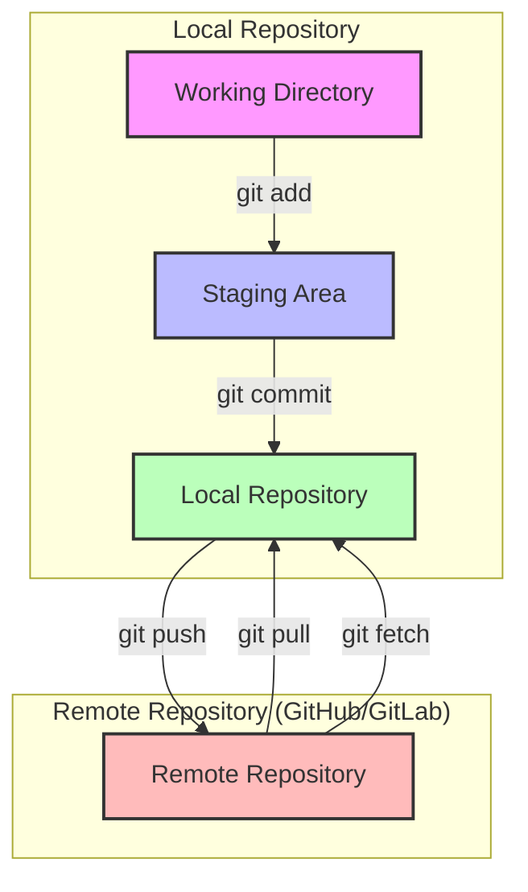

# 4.1 Remote-Repositories und Collaboration

## Einführung

In diesem Kapitel lernen Sie, wie Sie mit Remote-Repositories arbeiten und mit Teams zusammenarbeiten.

## Konzept Remote-Repositories



### Was ist ein Remote-Repository?

**Definition**: Ein Repository, das sich auf einem entfernten Server befindet (z.B. GitHub, GitLab, Bitbucket)

**Zweck**:
- Zentrale Anlaufstelle für Teams
- Backup der gesamten Projektgeschichte
- Kollaboration über Entfernungen
- Integration mit CI/CD-Tools

**Unterschied zum lokalen Repository**:
```
Lokales Repository:        Remote Repository:
- Auf Ihrem Computer       - Auf einem Server
- Vollständige Historie    - Vollständige Historie
- Schnelle lokale Operationen - Netzwerk-Operationen
- Keine Internetverbindung nötig - Internetverbindung nötig
```

## Remote-Repositories verwalten

### Remote-Repositories anzeigen

```bash
# Alle Remote-Repositories anzeigen
git remote -v

# Beispiel-Ausgabe:
origin  https://github.com/user/repo.git (fetch)
origin  https://github.com/user/repo.git (push)
```

### Remote-Repository hinzufügen

**Methode 1: Von GitHub/GitLab klonen**

```bash
# Repository von GitHub klonen
git clone https://github.com/user/repo.git

# Mit speziellem Namen klonen
git clone https://github.com/user/repo.git mein-projekt

# Mit SSH (statt HTTPS)
git clone git@github.com:user/repo.git
```

**Methode 2: Lokales Repository mit Remote verbinden**

```bash
# Lokales Repository initialisieren
git init
git add .
git commit -m "Initial commit"

# Remote-Repository hinzufügen
git remote add origin https://github.com/user/repo.git

# Remote-Repository anzeigen
git remote -v
```

### Remote-Repository entfernen

```bash
# Remote entfernen
git remote remove origin
```

## Synchronisation mit Remote

### Push: Lokale Änderungen zum Remote senden

```bash
# Erster Push (mit Branch-Setup)
git push -u origin main

# Folgende Pushes
git push origin main

# Push mit allen Branches
git push --all origin

# Push mit Tags
git push --tags origin
```

**Erklärung `-u` (upstream)**:
- Setzt die Verbindung zwischen lokalem und Remote-Branch
- Bei folgenden Pushes können Sie einfach `git push` verwenden

### Pull: Remote-Änderungen holen

```bash
# Änderungen vom Remote holen und mergen
git pull origin main

# Äquivalent zu:
git fetch origin
git merge origin/main
```

### Fetch: Remote-Änderungen holen (ohne Merge)

```bash
# Nur Änderungen holen, nicht mergen
git fetch origin

# Danach können Sie sehen, was geändert wurde
git log origin/main
```

## Branches über Remote

### Remote-Branches anzeigen

```bash
# Alle Remote-Branches anzeigen
git branch -r

# Alle Branches (lokal und remote) anzeigen
git branch -a
```

### Remote-Branch erstellen

```bash
# Lokalen Branch erstellen
git checkout -b feature/new-feature

# Zum Remote pushen
git push -u origin feature/new-feature
```

### Remote-Branch löschen

```bash
# Remote-Branch löschen
git push origin --delete feature/new-feature

# Oder:
git push origin :feature/new-feature
```

## Collaboration-Workflows

### Workflow 1: Feature-Branch-Workflow

**Ablauf**:
1. `main` Branch ist stabil
2. Für jedes Feature: neuer Branch von `main`
3. Feature entwickeln und committen
4. Pull Request erstellen
5. Code Review
6. Merge in `main`

**Beispiel**:
```bash
# 1. Aktuellen Branch aktualisieren
git checkout main
git pull origin main

# 2. Neuen Feature-Branch erstellen
git checkout -b feature/user-authentication

# 3. Feature entwickeln
# ... Code schreiben ...

# 4. Commit
git add .
git commit -m "Add user authentication"

# 5. Push zum Remote
git push -u origin feature/user-authentication

# 6. Pull Request auf GitHub/GitLab erstellen
```

### Workflow 2: GitFlow

**Struktur**:
- `main`/`master`: Produktionscode
- `develop`: Entwicklungscode
- `feature/*`: Features
- `release/*`: Release-Vorbereitung
- `hotfix/*`: Schnelle Bugfixes

**Beispiel**:
```bash
# Feature starten
git checkout develop
git checkout -b feature/payment

# Feature entwickeln
# ... Code ...

# Feature abschließen
git checkout develop
git merge feature/payment
git branch -d feature/payment

# Release erstellen
git checkout -b release/v1.0.0
# ... Vorbereitung ...

# Release mergen
git checkout main
git merge release/v1.0.0
git tag v1.0.0
git checkout develop
git merge release/v1.0.0
git branch -d release/v1.0.0
```

### Workflow 3: Fork-Workflow (für Open Source)

**Ablauf**:
1. Repository forken
2. Lokal klonen
3. Änderungen machen
4. Zum eigenen Fork pushen
5. Pull Request zum Original-Repository

**Beispiel**:
```bash
# 1. Repository forken (auf GitHub)
# 2. Fork klonen
git clone https://github.com/IHR_NAME/repo.git

# 3. Upstream hinzufügen (Original-Repository)
git remote add upstream https://github.com/ORIGINAL_NAME/repo.git

# 4. Änderungen machen
git checkout -b feature/improvement
# ... Code ...

# 5. Commit und push
git commit -m "Improve feature"
git push origin feature/improvement

# 6. Pull Request erstellen
```

## Konfliktlösung bei Collaboration

### Wann entstehen Konflikte?

**Szenario**:
```
Entwickler A: Ändert Zeile 10 in Datei X
Entwickler B: Ändert Zeile 10 in Datei X (gleiche Zeile)
Beide pushen ihre Änderungen
Git kann nicht automatisch mergen
```

### Konflikte erkennen

```bash
# Bei Pull
git pull origin main
# Ausgabe: CONFLICT (content): Merge conflict in datei.txt

# Bei Merge
git merge feature/branch
# Ausgabe: CONFLICT (content): Merge conflict in datei.txt
```

### Konflikt lösen

**1. Konflikt anzeigen**:

```bash
git status
```

**Ausgabe**:
```
Unmerged paths:
  (use "git add <file>..." to mark resolution)
        both modified:   datei.txt
```

**2. Konflikt in Datei anzeigen**:

```bash
git diff
```

**Konflikt-Markierung**:
```text
<<<<<<< HEAD
Änderungen von aktuellem Branch (main)
=======
Änderungen von anderem Branch (feature)
>>>>>>> feature/branch
```

**3. Konflikt manuell lösen**:

```bash
# Datei öffnen und bearbeiten
code datei.txt

# Entfernen Sie die Markierungen <<<<<<<, =======, >>>>>>>
# Wählen Sie die gewünschten Änderungen oder kombinieren Sie sie
```

**4. Konflikt als gelöst markieren**:

```bash
git add datei.txt
git commit -m "Resolve merge conflict"
```

### Konflikt vermeiden

**Best Practices**:
- Häufig synchronisieren: `git pull` regelmäßig
- Kleine Commits: Kleinere Änderungen, weniger Konflikte
- Kommunikation: Team über Änderungen informieren
- Code Review: Änderungen vor dem Merge überprüfen

## Best Practices für Collaboration

### 1. Commit-Nachrichten

**Gutes Beispiel**:
```
Add user authentication system

- Implement login functionality
- Add password hashing with bcrypt
- Create user session management
- Add logout functionality
```

**Schlechtes Beispiel**:
```
fix stuff
```

### 2. Branch-Namen

**Gute Namenskonventionen**:
- `feature/user-authentication`
- `bugfix/login-error`
- `hotfix/security-issue`
- `release/v1.0.0`

**Schlechte Namenskonventionen**:
- `new-feature`
- `fix`
- `temp`

### 3. Pull Requests

**Gute Pull Request Beschreibung**:
- Was wurde geändert?
- Warum wurde es geändert?
- Wie wurde es getestet?
- Gibt es bekannte Probleme?

### 4. Code Review

**Checkliste**:
- [ ] Code funktioniert
- [ ] Tests sind geschrieben
- [ ] Dokumentation ist aktualisiert
- [ ] Konventionen werden eingehalten
- [ ] Keine Sicherheitslücken

## Praktische Übung

### Übung 1: Remote-Repository erstellen

```bash
# 1. Lokales Repository erstellen
mkdir git-collaboration
cd git-collaboration
git init

# 2. README erstellen und committen
echo "# Collaboration Test" > README.md
git add README.md
git commit -m "Initial commit"

# 3. Remote hinzufügen (GitHub/GitLab)
git remote add origin https://github.com/IHR_NAME/git-collaboration.git

# 4. Push zum Remote
git push -u origin main
```

### Übung 2: Feature-Branch-Workflow

```bash
# 1. Von main Branch starten
git checkout main
git pull origin main

# 2. Neuen Feature-Branch erstellen
git checkout -b feature/add-documentation

# 3. Dokumentation hinzufügen
echo "# Dokumentation" > docs.md
git add docs.md
git commit -m "Add documentation"

# 4. Push zum Remote
git push -u origin feature/add-documentation

# 5. Zurück zu main
git checkout main
```

### Übung 3: Konflikt simulieren und lösen

```bash
# 1. Erstellen Sie eine Datei
echo "Zeile 1" > conflict.txt
git add conflict.txt
git commit -m "Add conflict.txt"

# 2. Push zum Remote
git push origin main

# 3. Erstellen Sie einen Feature-Branch
git checkout -b feature/conflict
echo "Zeile 1 - Feature" > conflict.txt
git add conflict.txt
git commit -m "Change in feature branch"
git push origin feature/conflict

# 4. Zurück zu main und Änderung machen
git checkout main
echo "Zeile 1 - Main" > conflict.txt
git add conflict.txt
git commit -m "Change in main branch"
git push origin main

# 5. Merge versuchen (wird Konflikt erzeugen)
git merge feature/conflict

# 6. Konflikt lösen
# ... manuell lösen ...
git add conflict.txt
git commit -m "Resolve conflict"
```

## Zusammenfassung

**Remote-Repositories**:
- Zentrale Anlaufstelle für Teams
- Backup und Kollaboration
- GitHub, GitLab, Bitbucket

**Synchronisation**:
- `git push`: Lokale Änderungen zum Remote
- `git pull`: Remote-Änderungen holen und mergen
- `git fetch`: Remote-Änderungen holen (ohne Merge)

**Collaboration-Workflows**:
- Feature-Branch-Workflow
- GitFlow
- Fork-Workflow (für Open Source)

**Konfliktlösung**:
- Erkennen mit `git status`
- Manuell lösen in der Datei
- Als gelöst markieren mit `git add`

{{ task(file="tasks/06_00_01.yaml") }}