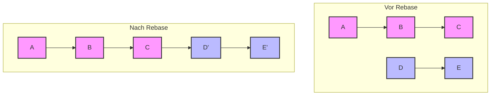
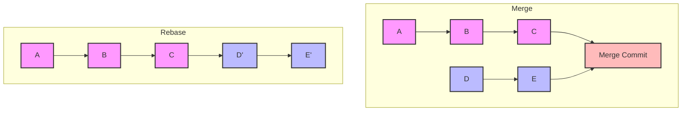

# 5.1 Fortgeschrittene Git-Features

## Einführung

In diesem Kapitel lernen Sie fortgeschrittene Git-Features kennen, die für professionelle Entwicklung unerlässlich sind.

## Git Rebase

### Was ist Rebase?

**Definition**: Rebase ist eine Alternative zum Merge, die die Commit-Historie "neu schreibt"

**Unterschied zu Merge**:
- **Merge**: Erstellt einen neuen Merge-Commit, der beide Branches verbindet
- **Rebase**: Bewegt Commits auf einen anderen Branch, erstellt neue Commits

**Visualisierung**:





### Wann Rebase verwenden?

**Gute Anwendungsfälle**:
- Lokale Branches bereinigen vor dem Push
- Feature-Branch auf aktuellen main Branch bringen
- Commit-Historie sauber halten

**Schlechte Anwendungsfälle**:
- Öffentliche Branches (andere Entwickler haben sie bereits)
- Komplexe Branches mit vielen Commits

### Rebase durchführen

**1. Rebase auf main**:

```bash
# 1. Zum Feature-Branch wechseln
git checkout feature/branch

# 2. Rebase auf main
git rebase main

# 3. Konflikte lösen (falls nötig)
# ... Konflikte lösen ...
git add .
git rebase --continue

# 4. Push (force push nötig, da Historie geändert)
git push --force-with-lease origin feature/branch
```

**2. Interaktives Rebase**:

```bash
# Letzte 3 Commits bearbeiten
git rebase -i HEAD~3
```

**Optionen im interaktiven Rebase**:
```
pick abc123 Commit 1
pick def456 Commit 2
pick ghi789 Commit 3

# Aktionen:
# pick = Commit behalten
# reword = Commit-Nachricht ändern
# edit = Commit bearbeiten
# squash = Mit vorherigem Commit zusammenführen
# fixup = Wie squash, aber ohne Commit-Nachricht
# drop = Commit löschen
```

### Rebase vs. Merge: Vergleich

| Aspekt | Rebase | Merge |
|--------|--------|-------|
| **Historie** | Linear, sauber | Verzweigt, komplex |
| **Commit-IDs** | Neue IDs (Commit-Historie ändert sich) | Alte IDs bleiben erhalten |
| **Öffentliche Branches** | Gefährlich | Sicher |
| **Lokale Branches** | Empfohlen | Möglich |
| **Konflikte** | Einmalig pro Commit | Einmalig pro Merge |

## Git Stash

### Was ist Stash?

**Definition**: Temporäres Speichern von nicht committeten Änderungen

**Anwendungsfälle**:
- Schneller Branch-Wechsel ohne Commit
- Temporäre Änderungen speichern
- Notfall-Sicherung

### Stash verwenden

**1. Änderungen stashen**:

```bash
# Aktuelle Änderungen stashen
git stash

# Mit Nachricht
git stash save "WIP: Feature X in Arbeit"

# Nur bestimmte Dateien stashen
git stash push datei1.txt datei2.txt
```

**2. Stash anzeigen**:

```bash
# Alle Stashes anzeigen
git stash list

# Beispiel-Ausgabe:
stash@{0}: WIP: Feature X in Arbeit
stash@{1}: WIP: Bugfix Y
```

**3. Stash wiederherstellen**:

```bash
# Letzten Stash wiederherstellen (und entfernen)
git stash pop

# Spezifischen Stash wiederherstellen
git stash pop stash@{1}

# Stash wiederherstellen (ohne zu entfernen)
git stash apply stash@{0}
```

**4. Stash löschen**:

```bash
# Letzten Stash löschen
git stash drop

# Spezifischen Stash löschen
git stash drop stash@{1}

# Alle Stashes löschen
git stash clear
```

### Praktische Beispiele

**Beispiel 1: Schneller Branch-Wechsel**:

```bash
# 1. In main Branch arbeiten
git checkout main

# 2. Änderungen machen (nicht committet)
echo "Test" > test.txt

# 3. Schnell zu Bugfix wechseln
git stash
git checkout bugfix/branch
# ... Bugfix machen ...
git commit -m "Fix bug"
git checkout main

# 4. Änderungen wiederherstellen
git stash pop
```

**Beispiel 2: Experimentelles Arbeiten**:

```bash
# 1. Experimentelles Feature entwickeln
echo "Experiment" > experiment.txt

# 2. Stashen für später
git stash save "Experimentelles Feature"

# 3. Weiterarbeiten an Hauptfeature
# ... Hauptfeature entwickeln ...

# 4. Experiment wieder aufnehmen
git stash pop
```

## Git Cherry-Pick

### Was ist Cherry-Pick?

**Definition**: Einzelne Commits von einem Branch auf einen anderen übernehmen

**Anwendungsfälle**:
- Bugfix von Feature-Branch zu main übernehmen
- Wichtige Änderungen aus experimentellem Branch übernehmen
- Hotfix verteilen

### Cherry-Pick durchführen

**1. Einfacher Cherry-Pick**:

```bash
# 1. Zum Ziel-Branch wechseln
git checkout main

# 2. Commit-ID des zu pickenden Commits finden
git log --oneline
# abc1234 Add user authentication

# 3. Cherry-Pick ausführen
git cherry-pick abc1234
```

**2. Cherry-Pick mit mehreren Commits**:

```bash
# Mehrere Commits auf einmal
git cherry-pick abc1234 def5678 ghi9012

# Bereich von Commits
git cherry-pick abc1234..def5678
```

**3. Cherry-Pick mit Konflikten**:

```bash
# 1. Cherry-Pick starten
git cherry-pick abc1234

# 2. Bei Konflikt:
# ... Konflikte lösen ...
git add .
git cherry-pick --continue

# Oder abbrechen:
git cherry-pick --abort
```

### Cherry-Pick vs. Merge

| Aspekt | Cherry-Pick | Merge |
|--------|-------------|-------|
| **Commits** | Einzelne Commits | Alle Commits |
| **Historie** | Neue Commits im Ziel-Branch | Verbindet Branches |
| **Kontext** | Gezielte Auswahl | Vollständige Integration |
| **Aufwand** | Höher (pro Commit) | Niedriger (einmalig) |

## Git Reset

### Was ist Reset?

**Definition**: Zurücksetzen des HEAD-Zeigers und optional der Staging Area/Working Directory

**Drei Modi**:
1. `--soft`: Nur HEAD zurücksetzen
2. `--mixed`: HEAD und Staging Area zurücksetzen (Standard)
3. `--hard`: HEAD, Staging Area und Working Directory zurücksetzen

### Reset durchführen

**1. Soft Reset**:

```bash
# Letzten Commit zurücksetzen (aber Änderungen behalten)
git reset --soft HEAD~1

# Mehrere Commits zurücksetzen
git reset --soft HEAD~3
```

**2. Mixed Reset (Standard)**:

```bash
# Letzten Commit zurücksetzen (Änderungen in Staging Area)
git reset HEAD~1

# Zu spezifischem Commit zurücksetzen
git reset abc1234
```

**3. Hard Reset**:

```bash
# Letzten Commit zurücksetzen (Änderungen verwerfen)
git reset --hard HEAD~1

# WARNUNG: Verwirft alle uncommitteten Änderungen!
git reset --hard abc1234
```

### Reset vs. Revert

**Reset**:
- Ändert die Historie
- Kann bereits gepushte Commits betreffen
- Gefährlich für öffentliche Branches

**Revert**:
- Erstellt neuen Commit, der Änderungen rückgängig macht
- Ändert die Historie nicht
- Sicher für öffentliche Branches

```bash
# Revert (sicher für öffentliche Branches)
git revert abc1234
```

## Git Reflog

### Was ist Reflog?

**Definition**: Protokoll aller HEAD-Änderungen (auch gelöschte Commits)

**Anwendungsfälle**:
- Verlorene Commits wiederherstellen
- Fehlende Branches finden
- Experimente rückgängig machen

### Reflog verwenden

**1. Reflog anzeigen**:

```bash
git reflog

# Beispiel-Ausgabe:
abc1234 HEAD@{0}: commit: Add feature
def5678 HEAD@{1}: commit: Fix bug
ghi9012 HEAD@{2}: commit: Initial commit
```

**2. Zu früherem Zustand zurückkehren**:

```bash
# Zu HEAD@{1} zurückkehren
git reset --hard HEAD@{1}

# Zu spezifischem Commit zurückkehren
git reset --hard abc1234
```

**3. Verlorene Commits finden**:

```bash
# Alle Reflog-Einträge anzeigen
git reflog show --all

# Nach spezifischem Commit suchen
git reflog --grep="feature"
```

## Git Bisect

### Was ist Bisect?

**Definition**: Binäre Suche durch Commit-Historie, um Bug zu finden

**Anwendungsfälle**:
- Finde Commit, der Bug eingeführt hat
- Performance-Regressionen finden
- Automatisierte Bug-Suche

### Bisect durchführen

**1. Manuelles Bisect**:

```bash
# 1. Bisect starten
git bisect start

# 2. Aktueller Commit ist schlecht (hat Bug)
git bisect bad

# 3. Letzter guter Commit (ohne Bug)
git bisect good abc1234

# 4. Git teilt Ihnen den nächsten Commit mit
# ... Testen ...
# Wenn gut: git bisect good
# Wenn schlecht: git bisect bad

# 5. Bisect beenden
git bisect reset
```

**2. Automatisiertes Bisect**:

```bash
# 1. Test-Skript erstellen
cat > test.sh << 'EOF'
#!/bin/bash
# Test, ob Bug existiert
python -m pytest tests/ --tb=short
EOF
chmod +x test.sh

# 2. Automatisches Bisect
git bisect start HEAD abc1234
git bisect run ./test.sh

# 3. Ergebnis anzeigen
git bisect reset
```

## Git Worktree

### Was ist Worktree?

**Definition**: Mehrere Arbeitsverzeichnisse für dasselbe Repository

**Anwendungsfälle**:
- Parallel an mehreren Branches arbeiten
- Schneller Branch-Wechsel ohne Checkout
- Testen in verschiedenen Umgebungen

### Worktree verwenden

**1. Worktree erstellen**:

```bash
# Neuen Worktree für Feature-Branch
git worktree add ../project-feature feature/branch

# Worktree mit spezifischem Commit
git worktree add ../project-commit abc1234
```

**2. Worktree anzeigen**:

```bash
git worktree list

# Beispiel-Ausgabe:
/pfad/zum/projekt  abc1234 [main]
/pfad/zum/projekt-feature  def5678 [feature/branch]
```

**3. Worktree löschen**:

```bash
git worktree remove ../project-feature
```

## Praktische Übung

### Übung 1: Rebase

```bash
# 1. Feature-Branch erstellen
git checkout -b feature/rebase-test

# 2. Mehrere Commits erstellen
echo "Commit 1" > file1.txt
git add file1.txt
git commit -m "Commit 1"

echo "Commit 2" > file2.txt
git add file2.txt
git commit -m "Commit 2"

echo "Commit 3" > file3.txt
git add file3.txt
git commit -m "Commit 3"

# 3. Rebase auf main
git checkout main
git merge feature/rebase-test

# 4. Interaktives Rebase
git checkout feature/rebase-test
git rebase -i HEAD~3
# Bearbeite: squash, reword, etc.
```

### Übung 2: Stash

```bash
# 1. Änderungen stashen
echo "WIP" > wip.txt
git stash save "Work in progress"

# 2. Branch wechseln
git checkout main

# 3. Stash wiederherstellen
git stash pop
```

### Übung 3: Cherry-Pick

```bash
# 1. Erstelle zwei Branches
git checkout -b feature/a
echo "A" > a.txt
git add a.txt
git commit -m "Add A"

git checkout main
git checkout -b feature/b
echo "B" > b.txt
git add b.txt
git commit -m "Add B"

# 2. Cherry-Pick von feature/a zu feature/b
git checkout feature/b
git cherry-pick feature/a
```

## Zusammenfassung

**Rebase**:
- Linearisiert Historie
- Für lokale Branches geeignet
- Vorsicht bei öffentlichen Branches

**Stash**:
- Temporäres Speichern von Änderungen
- Nützlich für schnelle Branch-Wechsel

**Cherry-Pick**:
- Einzelne Commits übernehmen
- Für gezielte Bugfixes

**Reset**:
- Zurücksetzen der Historie
- Drei Modi: soft, mixed, hard
- Vorsicht mit --hard!

**Reflog**:
- Verlorene Commits wiederherstellen
- Sicherheitsnetz für Git

{{ task(file="tasks/09_00_01.yaml") }}